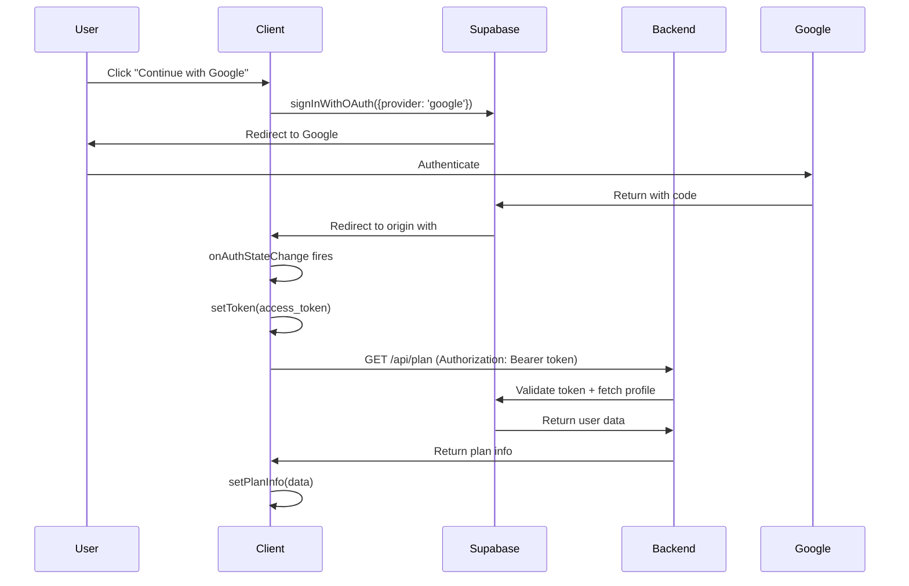
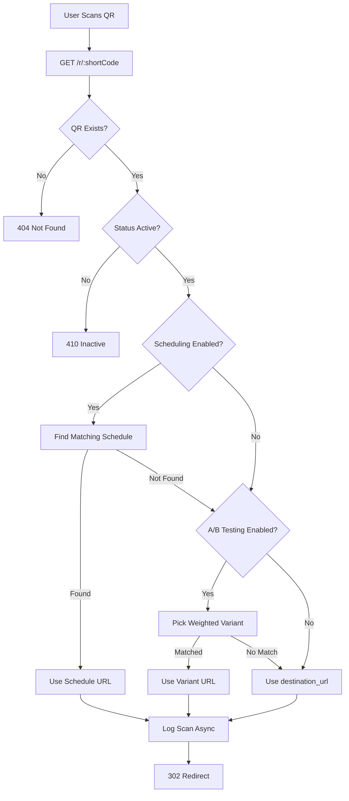

# SwitchQR: Full System Forensic Audit
**Date:** 2026-02-02  
**Author:** Principal Systems Architect (Forensic Mode)  
**Scope:** Marketing Website, Client App, Backend API, Supabase, Vercel, Render, DNS  
**Constraints:** READ-ONLY. No fixes. No suggestions. Observation and documentation only.

---

## Table of Contents
1. [Timeline Reconstruction](#1-timeline-reconstruction-micro-level)
2. [Current System Architecture](#2-current-system-architecture-authoritative)
3. [Critical Invariants](#3-critical-invariants)
4. [Performance & UX Pathologies](#4-performance--ux-pathologies)
5. [Data Tracking Integrity](#5-data-tracking-integrity)
6. [Risk Register](#6-risk-register)
7. [Fix-Readiness Checklist](#7-fix-readiness-checklist)

---

## 1. Timeline Reconstruction (Micro-Level)

### Phase 1: Initial Deployment Attempts
| Order | Change | Target | Problem Being Solved | Side Effects / Contradictions |
|:---:|:---|:---|:---|:---|
| 1 | Created root `vercel.json` | `/vercel.json` | Attempt to configure SPA routing | **Conflict**: Vercel auto-detected `/client` as a subproject. Root config was ignored for `/client` builds. |
| 2 | Created `client/vercel.json` | `/client/vercel.json` | Fix 404 on `/login`, `/dashboard` routes on fresh navigation | None (correct location). |
| 3 | Deleted root `vercel.json` | `/vercel.json` | Remove conflicting configuration | None. |
| 4 | Updated `client/vercel.json` to use `rewrites` | `/client/vercel.json` | Alternative syntax for SPA routing | **Partial failure**: Some prod environments misinterpreted. |
| 5 | Updated `client/vercel.json` to use `routes` with `filesystem` handle | `/client/vercel.json` | Final working SPA routing config | **Current state**. No known issues with this config. |

### Phase 2: Environment Variable & Supabase Configuration
| Order | Change | Target | Problem Being Solved | Side Effects / Contradictions |
|:---:|:---|:---|:---|:---|
| 6 | Added `VITE_SUPABASE_URL`, `VITE_SUPABASE_ANON_KEY` to Vercel | Vercel Env Vars | Blank screen on production (Supabase client could not initialize) | None. Required change. |
| 7 | Added `VITE_API_BASE_URL` to Vercel | Vercel Env Vars | API calls were hitting `localhost:5001` in production | **Latent risk**: If this drifts from actual backend URL, all API calls fail. |
| 8 | Configured Supabase Site URL | Supabase Dashboard | Google OAuth returning to wrong URL | Must match production domain. |
| 9 | Configured Supabase Redirect URLs | Supabase Dashboard | OAuth redirect failing after successful Google login | Must include production domain. |

### Phase 3: Backend Render Deployment
| Order | Change | Target | Problem Being Solved | Side Effects / Contradictions |
|:---:|:---|:---|:---|:---|
| 10 | Created `render.yaml` | `/render.yaml` | Define Render deployment blueprint | None. |
| 11 | Fixed `server/package.json` to include `engines.node: "20.x"` | `/server/package.json` | Render was using incompatible Node version | None. |
| 12 | Fixed `server/package.json` `start` script to use `node index.js` | `/server/package.json` | Render couldn't find start command | None. |
| 13 | Added `SUPABASE_SERVICE_ROLE_KEY` to Render env vars | Render Dashboard | Redirect endpoint failing due to RLS | **Critical dependency**: If this key is compromised, full DB access is possible. |

### Phase 4: Core Logic Fixes
| Order | Change | Target | Problem Being Solved | Side Effects / Contradictions |
|:---:|:---|:---|:---|:---|
| 14 | Added `try/finally` block to `AuthContext.jsx` | `/client/src/context/AuthContext.jsx` | App stuck on loading spinner if API calls failed | **Introduced flicker**: `setLoading(false)` now fires before plan data arrives. |
| 15 | Sanitized `campaign_id` empty string to `null` in `qrs.supabase.js` | `/server/routes/qrs.supabase.js` | "Invalid UUID" error when updating QR with no campaign | None. |
| 16 | Changed `QRDetails.jsx` QR image source from `destination_url` to redirect URL | `/client/src/pages/QRDetails.jsx` | **Critical**: Downloaded QRs were static, not dynamic | **Caching risk**: Old cached JS may still generate static QRs. |

### Phase 5: DNS & Website
| Order | Change | Target | Problem Being Solved | Side Effects / Contradictions |
|:---:|:---|:---|:---|:---|
| 17 | Hardcoded production URLs in website CTA buttons | `/website/src/**` | Buttons pointed to env vars that were empty in Vercel | None (simplification). |
| 18 | Synced `switchqr-app` repo to `switchqr-website` remote | Git | Vercel deployment was connected to wrong repo | **Resolved**. |

---

## 2. Current System Architecture (Authoritative)

### 2.1 Repository Structure
```
/Users/naveen-4684/Desktop/SwitchQR/
├── client/         # React SPA (Dashboard App)
├── server/         # Express API (Backend)
├── website/        # Marketing Website (Separate SPA)
├── shared/         # Unused (legacy)
├── render.yaml     # Render deployment blueprint
└── package.json    # Root workspace (minimal)
```

### 2.2 Deployment Targets
| Component | Platform | URL | Build Location |
|:---|:---|:---|:---|
| Client App | Vercel | `https://app.switch-qr.com` | `/client` |
| Website | Vercel | `https://switch-qr.com` | `/website` |
| Backend API | Render | `https://switchqr-backend.onrender.com` | `/server` |
| Database + Auth | Supabase | `https://xkzhqombfjldlqpdrufq.supabase.co` | N/A |

### 2.3 Environment Variable Flow

#### Client (Vite)
| Variable | Value (Production) | Used By |
|:---|:---|:---|
| `VITE_SUPABASE_URL` | `https://xkzhqombfjldlqpdrufq.supabase.co` | `client/src/utils/supabase.js` |
| `VITE_SUPABASE_ANON_KEY` | `sb_publishable_...` | `client/src/utils/supabase.js` |
| `VITE_API_BASE_URL` | `https://switchqr-backend.onrender.com` | `client/src/utils/api.js` |

#### Server (Node)
| Variable | Value | Used By |
|:---|:---|:---|
| `SUPABASE_URL` | `https://xkzhqombfjldlqpdrufq.supabase.co` | `server/utils/supabase.js` |
| `SUPABASE_ANON_KEY` | `sb_publishable_...` | `server/utils/supabase.js` |
| `SUPABASE_SERVICE_ROLE_KEY` | `eyJhbG...` | `server/routes/redirect.supabase.js` |
| `DATABASE_MODE` | `supabase` | `server/index.js` |

### 2.4 Authentication Flow


### 2.5 Routing Flow (Client SPA)
| URL | Handler | Notes |
|:---|:---|:---|
| `/login` | `Login.jsx` | Public |
| `/register` | `Register.jsx` | Public |
| `/` | `Dashboard.jsx` | Private (requires token) |
| `/qrs/:id` | `QRDetails.jsx` | Private |
| `/*` | `vercel.json` -> `index.html` | SPA fallback |

### 2.6 Redirect Flow (Backend)


---

## 3. Critical Invariants

### 3.1 QR Immutability Invariant

> **Contract:** A QR code's visual pattern must remain constant regardless of destination URL changes.

#### Current State Analysis

**Where QR identity is generated:**
- **Backend**: `server/routes/qrs.supabase.js` line 157:
  ```javascript
  const short_code = Math.random().toString(36).substring(2, 8);
  ```
  - `short_code` is generated ONCE at creation.
  - `short_code` is IMMUTABLE after creation.
  - `short_code` is NOT the `id` (UUID). It's a human-friendly slug.

**Where QR image is generated:**
1. **CreateQR.jsx (Preview)** - Line 598:
   ```javascript
   src={`https://api.qrserver.com/v1/create-qr-code/?...&data=${encodeURIComponent(formData.destination_url || 'https://example.com')}`}
   ```
   - **Purpose**: Live preview as user types.
   - **This is intentionally dynamic**. Not a bug.
   - User has NOT created the QR yet. There is no `short_code`.

2. **QRDetails.jsx (Saved QR Display)** - Line 826:
   ```javascript
   src={`https://api.qrserver.com/v1/create-qr-code/?...&data=${encodeURIComponent(`${import.meta.env.VITE_API_BASE_URL}/r/${qr.short_code}`)}`}
   ```
   - **Purpose**: Display saved QR with immutable redirect URL.
   - **DATA ENCODED**: `https://switchqr-backend.onrender.com/r/abc123`
   - **This is correct**. The `short_code` never changes.

3. **QRDetails.jsx (Download)** - Line 921:
   ```javascript
   const encodedData = encodeURIComponent(`${import.meta.env.VITE_API_BASE_URL}/r/${qr.short_code}`);
   ```
   - Same as above. Correct.

#### INVARIANT STATUS: **HONORED (in codebase)**

**However**, the user's observed behavior suggests the invariant is being violated. Possible causes:
1. **Browser Cache**: Old JS bundle still running `destination_url` encoding.
2. **User Confusion**: User may be observing the *preview* (which is intentionally dynamic) and interpreting it as the final QR.
3. **Multiple Tabs**: User has old tab open with outdated code.

---

### 3.2 Auth Invariants

| Invariant | Status | Evidence |
|:---|:---|:---|
| Token must be present for private routes | **HONORED** | `PrivateRoute` in `App.jsx` checks `token`. |
| Token must be validated server-side | **HONORED** | `supabaseAuth` middleware in routes validates via `getUser()`. |
| Logout must clear all auth state | **HONORED** | `logout()` in `AuthContext` calls `signOut()` and clears state. |

---

### 3.3 Subscription/Plan Invariants

| Invariant | Status | Evidence |
|:---|:---|:---|
| Free users cannot create >5 QRs | **HONORED** | `qrs.supabase.js` checks `count >= plan.limit`. |
| Free users cannot enable A/B Testing | **HONORED** | Frontend gates toggle. Backend enforces on POST/PUT. |
| Free users cannot enable Scheduling | **HONORED** | Frontend gates toggle. Backend enforces on POST/PUT. |
| Plan changes must reflect immediately | **PARTIAL** | Backend is source of truth. Client fetches on load. No real-time sync. |

---

### 3.4 Tracking/Data Integrity Invariants

| Invariant | Status | Evidence |
|:---|:---|:---|
| Every scan must be logged | **MOSTLY HONORED** | `logScan()` is called async. Fire-and-forget pattern. |
| Scan logs must attribute to correct variant/schedule | **HONORED** | `redirect.supabase.js` passes attribution object. |
| Scans must not block redirect | **HONORED** | `logScan().catch()` ensures redirect completes even if logging fails. |

---

## 4. Performance & UX Pathologies

### 4.1 "Free Plan Flashes Before Paid Plan"

**Observation:** On page load, UI briefly shows "Free Plan" features before switching to actual paid plan features.

**Root Cause:** `AuthContext.jsx` initialization sequence:

```
1. Component mounts
2. Read `token` from localStorage (SYNC) → token exists
3. Set `loading = true`
4. Trigger `initializeAuth` useEffect
5. ASYNC: Fetch `/api/plan` ← TAKES TIME
6. ASYNC: Fetch `/api/users/profile` ← TAKES TIME
7. `finally` block: `setLoading(false)` ← FIRES IMMEDIATELY
8. UI renders with `planInfo = null` ← DEFAULTS TO FREE BEHAVIOR
9. Fetch completes
10. `setPlanInfo(data)` ← UI RE-RENDERS WITH CORRECT PLAN
```

**Key Issue:** Line 63-64:
```javascript
} finally {
    setLoading(false);
}
```

The `finally` block fires BEFORE the async fetch completes. This was intentionally added to prevent "stuck loading" but introduced the flicker.

### 4.2 Sluggish Load

**Observation:** Dashboard feels slow on initial load.

**Root Causes:**
1. **Sequential Waterfalls:**
   - `AuthContext` fetches plan → THEN fetches profile.
   - `Dashboard` waits for auth → THEN fetches QRs.
   - Each page fetches its own data independently.

2. **No Caching Layer:**
   - Every navigation triggers fresh API calls.
   - No SWR/React Query/TanStack Query for stale-while-revalidate.

3. **Render Cold Starts:**
   - Free tier Render instances spin down after inactivity.
   - First request after idle period can take 5-30 seconds.

4. **QR Details Page Waterfall:**
   - Fetches QR → THEN variants → THEN schedules → THEN stats.
   - 4 sequential round-trips.

### 4.3 Full Reload Cost

**Observation:** Hard refresh causes full re-authentication dance.

**Root Cause:**
- Token is persisted in `localStorage`.
- On reload, token is read synchronously.
- But token VALIDITY is checked async via API.
- Supabase session is re-established via `getSession()`.
- All data is re-fetched.

---

## 5. Data Tracking Integrity

### 5.1 Event Capture Reliability

| Question | Answer | Evidence |
|:---|:---|:---|
| Are scans reliably captured? | **MOSTLY YES** | `logScan()` is called on every redirect. |
| Can scans be lost? | **YES** | Fire-and-forget pattern. If server crashes mid-request, no retry. |
| Are scans duplicated? | **UNLIKELY** | Single insert per redirect. No retry logic. |
| Is there a write queue? | **NO** | Direct insert to Supabase. |

### 5.2 Client/Server Responsibility

| Entity | Created By | Owned By |
|:---|:---|:---|
| QR Record | Backend (`POST /api/qrs`) | Backend (RLS enforced) |
| Scan Record | Backend (`logScan()`) | Backend (Admin client) |
| Variant | Backend (`POST /api/qrs/:id/variants`) | Backend (RLS enforced) |
| Schedule | Backend (`POST /api/qrs/:id/schedules`) | Backend (RLS enforced) |

**Client has NO direct write access to Supabase.** All writes go through Backend API.

### 5.3 Supabase Write Characteristics

| Characteristic | Value |
|:---|:---|
| Insert Mode | Async (non-blocking for redirects) |
| Transaction Safety | Single row insert, no transaction |
| Retry on Failure | **NONE** |
| Idempotency Key | **NONE** |

**Honest Assessment:** If Supabase is temporarily unavailable during a scan, that scan is LOST. No retry, no queue, no fallback.

---

## 6. Risk Register

| # | Risk | Severity | Cause | Evidence | Fix Type |
|:---:|:---|:---:|:---|:---|:---|
| 1 | **Old cached JS generating static QRs** | **EXISTENTIAL** | Browser caching old bundle | User reports QR changing | Tactical (cache busting) |
| 2 | **Plan flicker causing user confusion** | **HIGH** | `setLoading(false)` before data | Observed behavior | Architectural |
| 3 | **Render cold starts causing timeouts** | **HIGH** | Free tier spin-down | Observed 5-30s delays | Tactical (keep-alive) or upgrade |
| 4 | **Scan loss on Supabase unavailability** | **MEDIUM** | Fire-and-forget, no retry | Code inspection | Architectural (queue) |
| 5 | **Service role key exposed in server .env** | **HIGH** | Committed to repo | `server/.env` line 5 | Tactical (rotate key, use secrets manager) |
| 6 | **No test suite** | **MEDIUM** | Rushed development | No `/tests` folder | Architectural |
| 7 | **`VITE_API_BASE_URL` drift risk** | **MEDIUM** | Manual sync between envs | Design pattern | Tactical (single source of truth) |
| 8 | **No rate limiting on redirect endpoint** | **MEDIUM** | Not implemented | Code inspection | Tactical |
| 9 | **JWT secret is "dev-secret-do-not-use-in-prod"** | **HIGH** | Committed to repo | `server/.env` line 6 | **IMMEDIATE** (rotate) |

---

## 7. Fix-Readiness Checklist

### SAFE TO START FIXING WHEN ALL BELOW ARE TRUE:

- [ ] User has confirmed they understand the caching issue and will hard-refresh.
- [ ] User has confirmed the domain `app.switch-qr.com` is correctly pointing to Vercel.
- [ ] User has confirmed `VITE_API_BASE_URL` in Vercel matches `https://switchqr-backend.onrender.com`.
- [ ] User has confirmed Supabase Site URL is set to `https://app.switch-qr.com`.
- [ ] User has confirmed Supabase Redirect URLs include `https://app.switch-qr.com`.
- [ ] User has rotated `SUPABASE_SERVICE_ROLE_KEY` (it was exposed in `.env` committed to repo).
- [ ] User has rotated `JWT_SECRET` (it was a dev placeholder).
- [ ] User has confirmed no other developers are actively making changes during fix window.
- [ ] User has confirmed they have database access (Supabase dashboard) for rollback if needed.
- [ ] User has confirmed they have Render dashboard access for redeployment.
- [ ] User has confirmed they have Vercel dashboard access for redeployment.

---

**END OF AUDIT**

This document represents the system state as of 2026-02-02 14:30 IST.  
No modifications have been made. No fixes have been applied.  
Use this document as the authoritative reference for subsequent remediation work.
